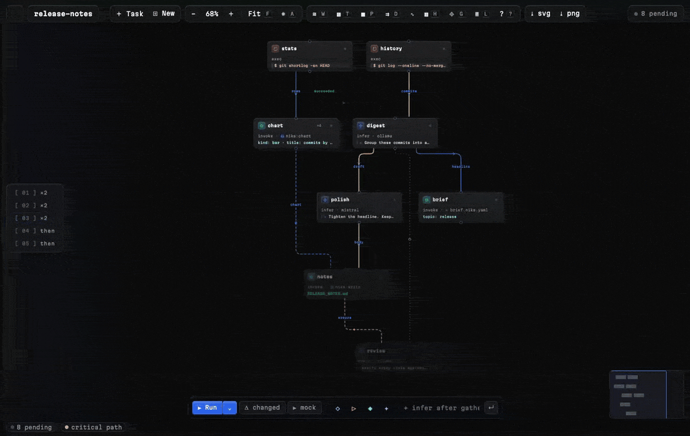
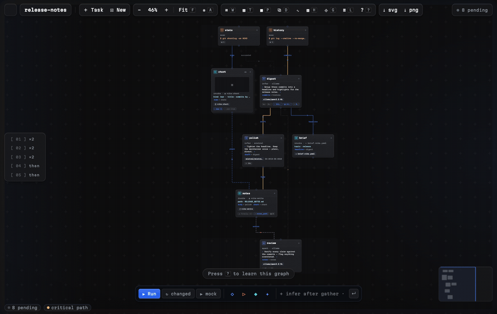
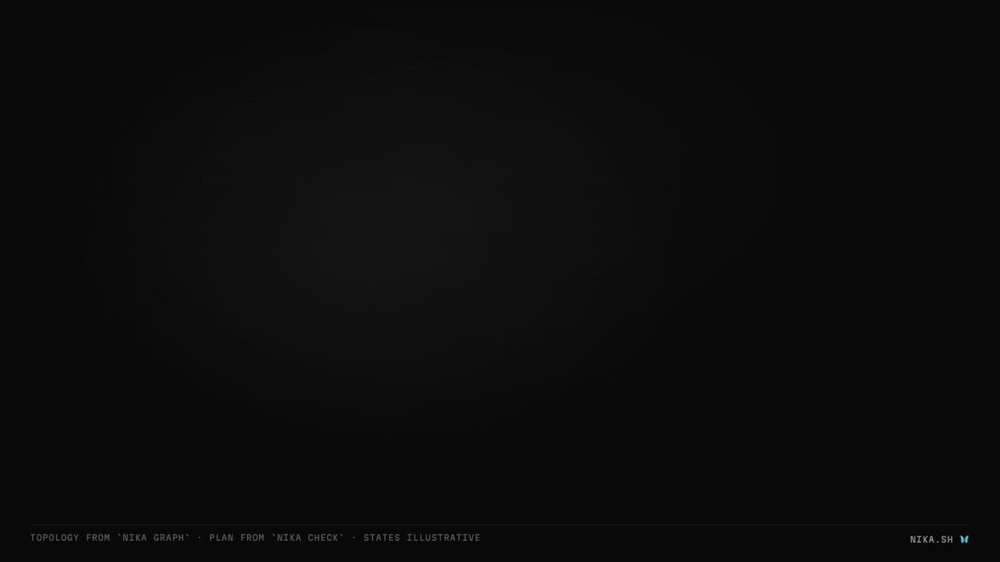

<p align="center">
  <a href="https://nika.sh">
    <picture>
      <source media="(prefers-color-scheme: dark)" srcset="https://nika.sh/brand/nika-logo-dark.png">
      
    </picture>
  </a>
</p>

# Nika Workflow Language · VS Code · Cursor · Windsurf · VSCodium

[](https://marketplace.visualstudio.com/items?itemName=supernovae.nika-lang)
[](https://open-vsx.org/extension/supernovae/nika-lang)
[](https://open-vsx.org/extension/supernovae/nika-lang)

**Your AI workflow as a live graph.** A `.nika.yaml` file becomes a
content-first canvas: prompts on the cards, wires carrying named data,
policy and permits as chips, cost as a running meter. And when you press
▶, the graph executes wave by wave and closes on a verdict with a
verifiable receipt:



*Real webview, real message protocol: this capture drives the extension's
own bundle through the same `dag:*`/`run:*` messages a live `nika run`
streams (scripted replay; regenerate with [`scripts/media/`](scripts/media/)).*

> One extension, every VS Code-compatible editor. `nika-vscode` is the
> repo name because that's the extension *platform* (like `vscode-eslint`)
> · it ships to the **VS Code Marketplace** AND **OpenVSX**, so Cursor,
> Windsurf, VSCodium and friends install it natively. JetBrains/Zed/Neovim
> get the same brain via `nika lsp` + the published JSON Schema.

Language support for [Nika](https://nika.sh) (`.nika.yaml`) · **Intent as
Code**, the workflow language for AI (one file, 4 verbs, one binary) that
turns repeatable AI work into files you can run, review, diff and share.
And **the only one auditable BEFORE it runs**: cost ceiling, permits
boundary, secret flows and schema parity are all static facts the editor
paints in the margin, before a single token is spent. Apache-2.0 spec ·
AGPL engine.


*The diagnostics above are the real `nika check --json` output: codes,
messages and positions come from the engine, not the extension.*

## 30 seconds to the wow

The **🦋 status-bar item** is the one door: its menu opens on *your*
next step · no engine yet → **Finish Setup** (verified download · MCP ·
LSP, one gesture) · fresh repo → **Init this project** · then the
10-second proof and your files' Run · Check · Graph.

1. Open any folder → **`Nika: New Workflow`** (or open a `.nika.yaml`).
2. **`Nika: Show Workflow DAG`**. The file becomes a content-first
   canvas: prompts on infer cards, `$ commands` on exec cards.
3. Press **▶ mock** on the run pill. The DAG lights up wave by wave with
   `mock/echo`: **deterministic, zero API keys, zero network.**

That's the whole loop: the same file then runs on any of the engine's
providers (local Ollama/llama.cpp/vLLM first-class) by swapping `model:`.

## Install

- **VS Code** · search **“Nika”** in Extensions, or
  [Marketplace → supernovae.nika-lang](https://marketplace.visualstudio.com/items?itemName=supernovae.nika-lang)
- **Cursor · Windsurf · VSCodium** · same search; they install from
  [OpenVSX → supernovae/nika-lang](https://open-vsx.org/extension/supernovae/nika-lang)
- **The engine** (optional but where the magic lives) ·
  `brew install supernovae-st/tap/nika`, or let the extension offer a
  verified download on first open (HTTPS + SHA-256 · explicit consent ·
  [policy](https://github.com/supernovae-st/nika-vscode/blob/main/README.md)).
  Without the binary you still get syntax, snippets and the client-side
  DAG (schema-driven completions come alive once the binary is found:
  they read the engine's own `nika schema`).

## Icons in your editor

The extension ships the butterfly everywhere VS Code lets it: the
Marketplace tile, the activity bar, and a **language icon** so `*.nika.yaml`
files carry the 16 px glyph in themes that honor language icons (Seti, the
default, does). File/folder icons beyond that belong to your *file icon
theme*, not to extensions:

- **Material Icon Theme** · give the engine's `.nika/` folder an icon today:
  ```jsonc
  "material-icon-theme.folders.associations": { ".nika": "flow" }
  ```
- **vscode-icons** · full custom butterfly (file + folder + open-folder):
  see [`contrib/`](contrib/README.md).
- Upstream Material icons (real `nika` file + `.nika` folder artwork) are
  submitted: [material-icon-theme#3530](https://github.com/material-extensions/vscode-material-icon-theme/pull/3530)
  (sources in [`contrib/material-icon-theme/`](contrib/README.md)).

## Features

### The audit moat, in the editor
- **Check-as-you-type** · `nika check --json` painted as diagnostics
  (conformance · secret leaks/egresses · permits escapes · schema findings ·
  unknown tools · **typo'd or missing tool args with did-you-mean** ·
  **provably dead `when:` gates** · hints), with `NIKA-XXXX` codes linking
  to explanations: the full `is_clean` family list, so the editor's
  verdict IS the binary's exit code
- **No tmp-file dance** · dirty and untitled buffers pipe straight into
  the binary over stdin (`nika check -` · 0.94+): keystroke-fresh audits
  without ever touching your disk; older engines keep the tmp fallback
- **One-keystroke permits repair** · the engine's machine-applicable fix
  grammar (`add "X" to permits.<path>`) applied as a quick fix · the same
  convergence loop agents run in CI
- **Inferred boundary** · one command inserts the whole `permits:` block
  derived by `check --infer-permits` (default-deny from then on)
- **Static cost audit** · per-task `$min–max` inlay hints + the workflow
  ceiling on a code lens · audited before a single token is spent
- **A door on every language line** · a lens title is a call, not a
  caption · each line offers the gesture it's for, fed by the SSOT
  that owns it (the spec's oracle-proven starters · THIS binary's
  catalog · the file's own DAG). The full map:

  | line | door | writes |
  |---|---|---|
  | `nika:` | GitHub | (the project door) |
  | `workflow:` | Check · DAG · Run | (the action row) |
  | `description:` | Explain | (the offline narrative) |
  | `model:` | *choose your model* | the catalog ref (local-first) |
  | `vars:` | *declare an input* · *make it callable · N untyped* | a typed/untyped input · untyped→typed promotion |
  | `tasks:` (status row) | verdict + ceiling · *add a task* · *declare the boundary* · *choose your model* (no model anywhere) · *choose what it publishes* (on dead-spend) · *N vars ride --var* | each run-blocking gap, one gesture |
  | `greet:` (the task key) | *re-run* · *see it in the graph · N refs* · *make it resilient* (only after a FAILED run) | `run --task` · DAG focus · retry/recover/skip/timeout |
  | `after:` | *order on state* | pre-checked multi-pick of `{producer: predicate}` control entries · descendants never offered (cycle-safe) |
  | `when:` | *choose a gate* | a CEL v0.1 shape over LOCAL reads (vars · with) · upstream state becomes `after:` · an upstream value hoists through `with:` first |
  | `for_each:` | *choose the collection* | typed array vars · upstream outputs (bound through `with:` — the binding IS the edge) |
  | `infer:`/`exec:`/`agent:` | *choose a starter* · *type its output* (schema missing) | the spec's shapes · a proven schema (fields · list · verdict · grade) |
  | `invoke:` | *choose your tool* | starters + every builtin THIS binary carries, args skeleton from the tool's own schema |
  | agent `tools:` | *choose its tools* | the catalog multi-pick · MCP/globs/strangers survive verbatim; `[]` is least privilege |
  | `outputs:` | *choose what it publishes* | owned rows re-picked; typed/jq/commented rows survive verbatim |
  | `permits:` | *tighten the boundary* | the `--infer-permits` recompute (one undo) |

  Every write is surgical (one edit · one undo), refuses a moved
  anchor, and never guesses what the engine can judge.
- **Secrets lint** · literal credentials flagged locally (pure scan · zero
  network) with a `${{ env.VAR }}` rewrite quick fix

### Language intelligence (LSP-grade · live today)
- **Schema-derived completions & hover** · every key, enum and doc comes
  FROM the binary (`nika schema` + `nika spec --canon`): top-level keys,
  task fields, per-verb bodies, `capture`/`backoff_strategy` enums, the
  closed builtin tool set, provider-prefixed `model:` values, `nika:fetch`
  extract modes · a new field in the engine lights up here with zero
  extension update
- **`${{ ... }}` expression intel** · completions, hover and
  go-to-definition for `tasks.` / `with.` / `env.` / `secrets.` / `vars.`
  references
- **Task rename & find-references** · hits all 4 syntactic homes
  (declaration · `after:` entries · `${{ tasks.X }}` islands · bare CEL
  in WIP text) and enforces the engine id grammar (snake_case · CEL-safe)
- **Linked editing** · type in ANY home of a task id and every reference
  follows live · **selection ranges** (word → line → task → tasks →
  document smart-expand) · **task dependency hierarchy** in the native
  Call Hierarchy UI (incoming = what it unlocks · outgoing = what it needs)
- **Workspace-wide lint** · CLOSED `.nika.yaml` files ride `nika check`
  into the Problems panel too (open files stay live) · per-code severity
  remap (`nika.diagnostics.severity` · exact or `NIKA-SEC-*` globs · `off`
  hides a code) · related-information walks you to both ends of a
  missing wire
- **Language status** · the `{}` flyout carries the engine version, the
  ACTIVE file's check verdict (busy while a pass runs) and the LSP state
- **Outline / breadcrumbs** · tasks with verb detail + the permits boundary
- **Full LSP** (the day the binary ships `nika lsp`, it takes over
  automatically · the client declares which layers it keeps via
  initializationOptions, no double-reporting)
- **Syntax + snippets + semantic scopes** for the 4-verb surface · every
  snippet is own-corpus tested against `nika check`
- **Add Task from anywhere** (`⌘K ⌘N` · `Nika: Add Task`) · one picker
  speaking the canvas palette's vocabulary · the 4 verbs and every
  builtin as a pre-wired `invoke:` (the binary's own catalog with its
  descriptions when present) · the skeleton lands after the task under
  your cursor, selection on the new id

### Understand before it runs · prove after it ran

- **Preflight: the flight plan before any token** · `Nika: Preflight`
  composes what nothing else shows pre-run: every infer/agent model
  resolved against the engine catalog (`nika catalog`: the embedded
  provider/model list with capabilities and env-var requirements; the
  builtin side lives in `nika tools`, the `nika:*` schemas an `invoke`
  can reach without MCP) and its key requirements (local
  providers marked sovereign · mock marked zero-spend), secrets and env
  reads checked against your actual environment (`env`-sourced
  verified; vault/file say *declared*, never *verified*), permits +
  capability escapes + secret flows, the wave-by-wave plan, and the
  cost ceiling, with the **prices named** (nika ≥ 0.98): the pricing
  snapshot's provenance line (source · date · model count) plus a
  staleness hint past 120 days, so every estimate says which prices
  produced it. A **verdict chip on the run pill** keeps it glanceable
  (`✗ 2 missing` · `⚠ flows` · `✓ preflight`); click it for the doc
- **Lineage: follow the data** · click a card, or put the caret inside
  `${{ tasks.x… }}` in the YAML: the producer and every consumer stay
  lit (direct neighbors louder than the transitive cone), the data
  wires saturate, everything else fades. Esc clears
- **Source-bound run highlight** · while a run executes or a replay
  scrubs, the YAML spans of the RUNNING tasks glow: the source *is*
  the timeline
- **X-ray ghost values** · every `${{ tasks.x… }}` shows what it
  resolved to in the last matching recorded run, inline (` = "Hello
  HN"` · full value on hover). No recorded value → no hint
- **Fork-from-step** · pick a task in a recorded run (⑂ in the Runs
  view): it and its downstream re-execute, everything upstream
  rehydrates from the trace: counterfactual iteration without
  re-spending the cone above
- **Run report** · one markdown per recorded run: verdict, per-task
  table, **artifacts with provenance** (image outputs render inline),
  failures with their **retry ladder** (each attempt's NIKA-code and
  clock). Every line is the trace's own events; gaps are stated, never
  filled
- **Test Explorer** · golden-backed workflows (`<file>.golden.json`)
  run in the native testing UI: the failure message IS the engine's
  per-path diff; a second profile re-pins the golden explicitly

### One graph · five lenses



The canvas is a deck of projections over the SAME typed graph — the
language gives it what no other canvas has (typed edges · pass-sets ·
engine-attributed permits · static cost · recorded clocks), and each
lens renders one question:

- **X · what if?** — pick a task, press **X**: the client replays
  admission by the gate algebra. Dead paths dim to their cancelled
  read, and the paths that exist *only because of failure* **light
  up** — why `on_error` exists, visible before any token is spent
- **T · timeline** — the recorded run as a Gantt: real clocks only,
  retries as sub-segments, cache hits hollow, the **ghost ceiling**
  (your recorded mean) behind every bar — est-vs-actual at a glance,
  and the replay scrubber's cursor rides the lens
- **P · audit** — *what can this file DO before a token is spent*:
  capability hulls (egress · programs · files · tools) painted under
  the wires, and the banner says it in one line — « this file can:
  reaches example.com — runs git — est ≥$0.0010 »
- **D · dataflow** — where the data comes from and goes: the control
  scaffolding sleeps, the typed data wires and their bindings carry
  the whole story
- **H · heatmap** — where the time went, as a toggle, never ambient

### See the run



- **DAG visualization** · the engine's canonical graph projection (verb ·
  model · when-gates ⌁ · fan-out ×N · cost badges) · click-to-jump ·
  mermaid/dot export · **SVG/PNG image export** (styles + font embedded)
- **Arriving is describing** · a fresh (zero-task) workflow greets you
  with a centered describe bar: type the intent, the oracle-checked
  generate lands the tasks. Or press **N**: one searchable **task
  palette** with the 4 verbs and the full builtin-tool vocabulary,
  grouped by category (picking a tool lands an `invoke` task pinned to
  it, named after the tool; its required args arrive as check findings:
  the engine teaches). `⧇ New` opens the next blank page without
  leaving the canvas
- **The generation lands on the card** · media tasks show their
  RECORDED artifact: image thumbnails (click opens the file) and
  playable audio rows, pulled from the latest matching trace and
  refreshed the moment a live run closes. Engine truth only: a file a
  run actually wrote, or nothing. Running tasks tick their **observed
  elapsed** (`12.4s ⋯`) until the engine's measured duration lands
- **The dense card** · the substance lives ON the node: an **io row**
  names the inbound wires (`alias ← producer`; click one, jump to the
  producer, `+N` when more), a **policy row** carries the declared
  execution policy as chips (`↻×3` retry budget · `⏱ 30s` timeout ·
  on_error route `✚ recover`/`⤼ skip`/`✗ fail` · `⤳ 2 outs` named
  output bindings · `▦ N` permits, engine-projected), and a settled
  verdict shows its recorded spend (`✓ 1.2s · $0.0042`). Cards wear two
  modes — `min` (head · verdict · one essence line) and `grand` (the
  full story: run-story facts, blast radius, pinch, needs/unlocks
  jumps, and a visible actions row `▸ run · ⚡ what if · ❏ dup`, plus
  `✎ explain + ⑂ fork` on a failed card). Double-click or `E` toggles
  one card, `Shift+V` sets the global cran (min / grand / mix), and
  `Space` peeks the focused card without touching the layout —
  **right-click stays a real VS Code menu** (run task · open YAML ·
  duplicate · delete · copy id). Facts only: nothing declared, nothing
  rendered
- **Content-first canvas** · the node IS the content: infer cards show
  their prompt, exec cards their `$ command`, invoke cards their tool +
  args, before any run. **Every verb has a soul**: `infer` wears a
  thought-aurora and its tile breathes while the model thinks, `exec`
  shows CRT scanlines and blinks a terminal caret while the subprocess
  is live, `invoke` carries flowing current while the tool call is in
  flight, `agent` has an orbit ring that rotates while the loop turns.
  Matter at rest, character only while RUNNING (every animation has a
  reduced-motion opt-out). The **model chip edits** (provider picker →
  one undoable YAML edit), `⌀` badges carry the mean duration across
  your recorded runs, ports appear on hover (drag out-port → card =
  `after: { from: succeeded }`, or drop on empty canvas → a new
  pre-wired task), and a
  **verb palette + omnibar** sits at the bottom: `+ infer after gather`
  inserts deterministically, `/text` filters, a sentence routes to
  oracle-checked generation. Semantic zoom keeps 100-task graphs
  readable as a map
- **Run from the canvas** · a **▶ Run / ▶ mock / ■ Stop** pill drives the
  run without leaving the panel; **▶ mock** streams
  `run --model mock/echo` (deterministic · zero keys · zero network).
  The DAG lights live; the pill flips ▶/■ from the real spawn/close.
  On a 0.93+ engine a **Δ changed** button joins the pill. Engine
  `--resume`: unchanged tasks cache-hit their recorded output (dashed
  `○ cached` cards, never a fake fresh-green), edited tasks re-run.
  **A repaired success never paints clean** (nika ≥ 0.98): a task saved
  by `on_error: recover` says `✚ recovered` in retry-amber: on the
  card, in the activity feed, in the legend chips and the run report,
  with the absorbed NIKA code in the card's fact block
- **The live cost ticker** · the status pill counts the run's recorded
  spend as tasks settle (`2 done · 4 running · ≥ $0.0022`): engine
  truth only, the `≥` because unpriced tasks make it a floor, and a
  mock/local-only run shows nothing rather than a fake `$0.00`. The
  card closes the loop per task: `cost $min → $max` (the estimate, on
  the params row) next to `spent $… recorded` (the terminal event's
  fact, in the grand fact block)
- **Time-travel replay** · click a recorded run and **scrub its whole
  timeline**: play/pause (Space), drag the handle, the DAG state at any
  instant computed locally. Replay re-renders, never re-executes
- **F5 time-travel debugger** (nika ≥ 0.96) · set breakpoints in your
  `.nika.yaml`, press **F5**, and the engine's own DAP adapter replays a
  recorded run under the real VS Code debugger: step **forward and
  backward** through task settles, inspect every recorded output in the
  Variables pane, `continue` runs to your next breakpointed task. Replay
  never re-executes, which is why stepping back is free. Also on every
  run in the Runs view: "Debug This Run (Replay · Time Travel)"
- **Export to OpenTelemetry** (nika ≥ 0.96) · one action on any recorded
  run projects its journal to OTLP/JSON lines: drag into Jaeger UI, or
  POST to Aspire/Grafana/Langfuse (cost included). Local file, zero
  collector, zero vendor
- **Tamper-evident runs** (nika ≥ 0.96) · every journal line hash-chains
  to the previous one; the Runs view walks the chain client-side: a
  broken journal gets a warning shield that outranks its run verdict,
  an intact one shows its head (compare against the one the run
  printed). The run report states its own integrity
- **Reproduce Run: determinism check** (nika ≥ 0.97) · right-click a
  run, pick another journal of the same workflow: every task classified
  reproduced / NONDETERMINISTIC (same def+inputs, different output) /
  authored / environment, with the engine attestation compared
- **Paused runs ask, you answer, they finish** · a `nika:prompt` task
  pauses the run (a pause is not a failure: the verdict goes amber ⏸
  with the question itself), a notification offers **Answer…**, and the
  control matches the mode: confirm → Yes/No, choice → the workflow's
  own options, input → a box. The answer resumes the exact journal the
  engine wrote: upstream cache-hits, the gated side effects run live
- **The cross-run story** · `Nika: Run History` renders the last runs of
  THIS workflow as a grid (rows = tasks · columns = runs): flaky steps
  are a recorded fact, not a guess; and **diff v2** compares any two
  runs leading with the **first divergence** (the culprit task, centered
  on the canvas), output changes and duration shifts after it
- **Dirty-nodes** · a `△ stale` badge marks every task edited since its
  last successful run (and its downstream cone): you see what a run
  will re-execute. The last-success state lives in a
  `.nika/canvas-state.json` sidecar, never in your workflow YAML
- **Regions** · a `# nika:region <name>` comment (ignored by the engine)
  groups the tasks that follow it into a labeled box on the canvas:
  logic grouping at zero cost to the YAML
- **Audit before you run** · the moat, on the canvas. A **cost forecast**
  rides the run pill: `$min–$max` when `nika check` can price it (a
  ceiling), an honest amber `≥ $X` when an uncapped task makes it a
  floor; **`⚠N` audit chips** on the cards surface the task's
  `nika check` findings (secret-flow · permits · schema · unknown-tools),
  click-through to the report; a **`△N` stale count** shows what a run
  will re-execute; a **`Δ ±$` cost delta** beside the ceiling shows what
  your edits changed vs the last commit (the delta is the review signal:
  amber only when it grew). Every number is static: read before a token
  is spent
- **Keyboard-drivable** · `Tab` / `⇧Tab` cycle the topological order, `↑`
  walks to a dependency, `↓` to a dependent, `Enter` opens the YAML: the
  whole canvas without the mouse
- **The nika.sh skin** · the panel ships the landing page's design
  language by default: engineered-black register, one blue accent, the
  4 verb hues as node LED spines (infer ◇ · exec ▷ · invoke ◆ · agent ✦),
  Martian Mono, a full-spectrum edge aurora that sweeps once on a clean
  run close and flashes red on failure · `nika.dag.theme: editor` follows
  your theme instead · `phosphor` is the OLED register: true-black
  pool, phosphor ink, and verb chroma that sleeps at rest and wakes
  ONLY on live tasks (the color is the execution) · high contrast
  always wins
- **`/` filter** · type to fade everything but matching tasks
  (id · verb · model · tool · provider) · Enter cycles the matches
- **The engineering read** · exact max parallelism (Dilworth antichain,
  with a witness set), speedup ceiling (work-span), k-worker wall-clock
  estimates (Graham-bounded list scheduling · measured milliseconds after
  a run), pinch points, and per-task failure blast radius · in the DAG
  explainer (`?`) and the card's fact block. Algorithms + citations:
  `docs/ALGORITHMS.md`
- **Live run** · `nika run` streams its event stream straight onto the
  DAG · statuses light per the §3.1 run-state machine (running · retrying
  · success · failed · cancelled · skipped), terminal transitions narrate
  in the activity feed, the verdict + cost land on close. The same canonical
  NDJSON the flight recorder writes, painted in real time
- **Flight recorder** · a Runs view over `.nika/traces/*.ndjson` (status ·
  duration · cost per run) and **animated trace replay** through the DAG;
  replay re-renders, never re-executes
- **Golden test, one command** · `Nika: Golden Test` runs
  `nika test <file>` (mock provider · offline · deterministic) against
  `<file>.golden.json`, and `Update the Golden` re-pins it: the offline
  CI gate without leaving the editor
- **Validate / Inspect / Explain / Dry-run** from the editor:
  `nika check` diagnostics, `nika inspect` anatomy, a **deterministic
  Explain Workflow** (the story wave-by-wave · cost ceiling · what it
  touches · structural risks; zero LLM, works offline), and the
  engine's `--dry-run` plan; tasks + problem matcher
- **The 0.93 loop rides the integrated terminal** · launch inputs with
  `nika run --var key=value` · pin the output contract with
  `nika test <file> --update` and keep `nika test` as the offline CI gate
  (the mock synthesizes schema-conformant output) · a run you killed,
  or a durable `nika:prompt` pause (exit 4, journaled as
  `workflow_paused`), resumes with `nika run --resume <trace>`
  (`--answer approve=true` re-arms the gate · cache hits stay visible) ·
  every recorded run in the flight recorder doubles as that checkpoint ·
  `nika trace show <run>` re-renders any of them in the terminal ·
  scaffold from the same embedded corpus the snippets are tested against
  (`nika examples` · `nika new --from <template>`) · any code explained:
  `nika explain NIKA-XXXX`

### Agent-native
- **LM tools** · `nika_check` / `nika_explain` / `nika_graph` registered as
  Language Model Tools · in-editor AI agents validate the workflows they
  write through the REAL oracle instead of guessing
- **MCP + rules setup** · one command wires editor MCP config and Cursor
  rules: engine-canonical through `nika wire` when the binary ships it,
  with a one-tap follow-up for codex/claude; `nika init` scaffolds the
  repo-local `AGENTS.md`. On VS Code 1.101+ agent mode discovers
  `nika mcp` natively (zero config files)
- **Doctor** · `Nika: Doctor` runs the engine's own environment diagnosis
  (binary · config · provider keys · image/tts planes): prints exact
  fixes, never mutates; **`Doctor + Ping`** (0.94+) opt-in TCP-probes your
  LOCAL provider ports only (Ollama · LM Studio · llama.cpp · LocalAI ·
  vLLM; loopback, 300ms cap, nothing sent on the socket)
- **Works with your CLI agents too** · `nika wire cursor` / `claude` /
  `windsurf` / `codex` patches each client's MCP config (idempotent ·
  preserves your other servers) so Claude Code, Codex CLI and friends
  call the same oracle from the terminal
- **One plugin, three ecosystems** · Cursor: search "nika" in Settings →
  Plugins (one Add installs skill + subagent + commands + check-on-edit
  hook + MCP oracle) · Codex: `codex plugin marketplace add
  supernovae-st/nika-agents` + `codex plugin add nika@nika` · Claude Code:
  `claude plugin marketplace add supernovae-st/nika-agents` + `claude
  plugin install nika@nika`. This extension is the IDE surface; the
  [nika-agents](https://github.com/supernovae-st/nika-agents) plugin is
  the agent surface · its README carries the who-does-what map (plugin =
  per-agent · `nika init` = per-repo · `nika wire` = per-machine).
- **Deterministic authoring prompt** · copy the template→check→repair
  protocol for any chat agent

### Engine-honest by construction
- **Capability-gated UI** · the extension probes what the binary ACTUALLY
  ships (`--help`) · the static suite + `run` light up today (the gate lit
  `run` the day nika-runtime reached L3, zero extension update); `lsp` /
  `mcp` light up the same way the day they climb
- **Binary = vocabulary SSOT** · spec, JSON schema, examples and templates
  are read from the self-contained binary (`nika spec` · `nika schema` ·
  `nika examples` · `nika new`) · nothing duplicated, nothing drifts
- **Binary auto-download** · optional (`nika.server.autoDownload`) · SHA256
  verified · zero telemetry anywhere

## The language (4 verbs · locked forever)

```yaml
nika: v1
workflow:
  id: hello

model: mock/echo          # deterministic · swap for ollama/qwen3.5:4b or any provider

tasks:
  greet:
    infer:
      prompt: "Say hello in French, in one short sentence."
```

`infer` (LLM) · `exec` (subprocess) · `invoke` (builtin/tool · HTTP fetch is the
`nika:fetch` builtin here) · `agent` (agent loop · default-deny tools).

### Canvas regions (editor-only · engine ignores it)

A `# nika:region <name>` comment groups the tasks that follow it into a
labeled box on the DAG canvas. It's a plain YAML comment; the engine
never sees it, so it costs nothing at runtime:

```yaml
tasks:
  # nika:region Ingest
  fetch_pr:
    invoke: { tool: "nika:fetch", args: { url: "${{ vars.pr_url }}" } }
  analyze_diff:
    with: { diff: ${{ tasks.fetch_pr.output }} }
    infer: { prompt: "Plan the review of ${{ with.diff }}." }

  # nika:region Ship
  post_comment:
    after: { analyze_diff: succeeded }
    exec: { command: ["gh", "pr", "comment", "${{ vars.pr }}", "--body-file", "verdict.md"] }
```

## Links

- **Every door in one page**: install paths, IDEs, agents, skills, MCP, CI, SDKs: [docs.nika.sh/integrations/everywhere](https://docs.nika.sh/integrations/everywhere)
- Language spec (Apache-2.0) · https://github.com/supernovae-st/nika-spec
- Engine (AGPL-3.0-or-later) · https://github.com/supernovae-st/nika
- Docs · https://docs.nika.sh

---
🦋 SuperNovae Studio · Paris
