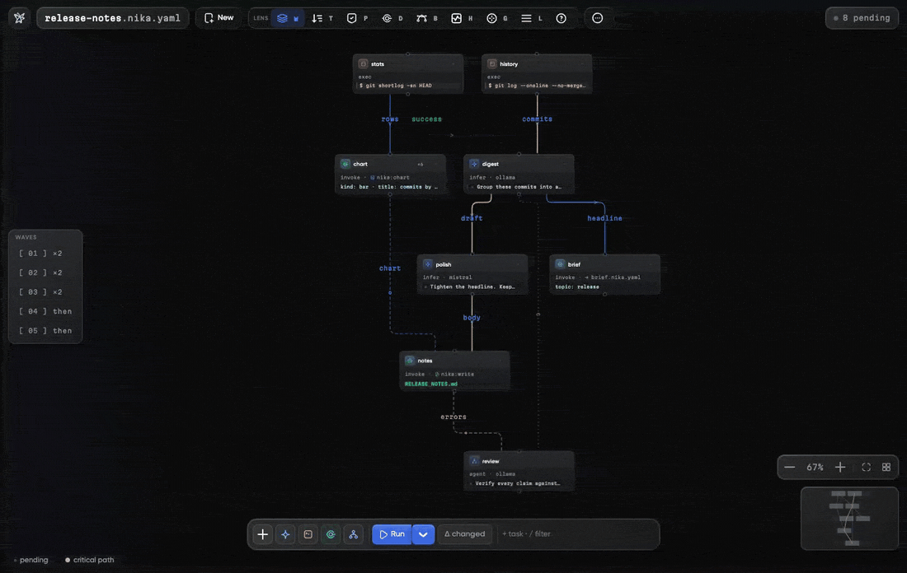
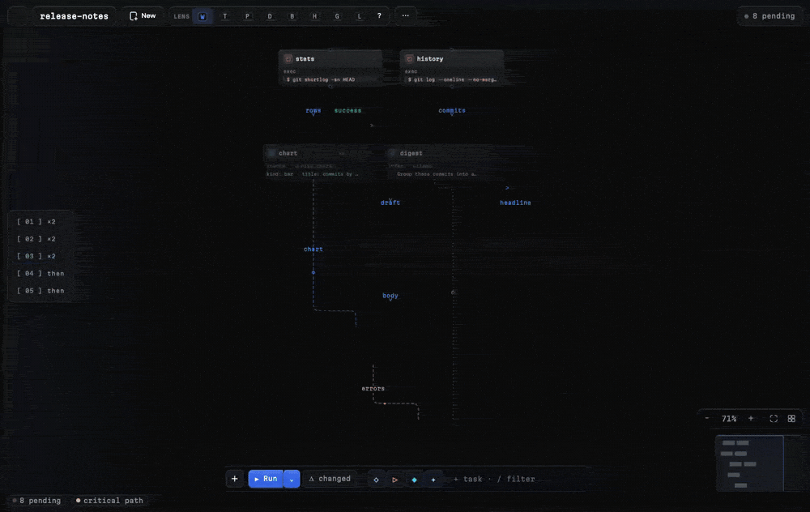
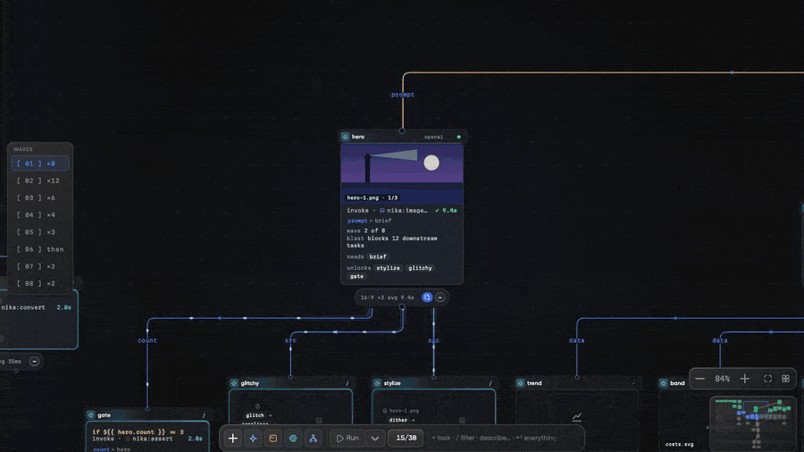
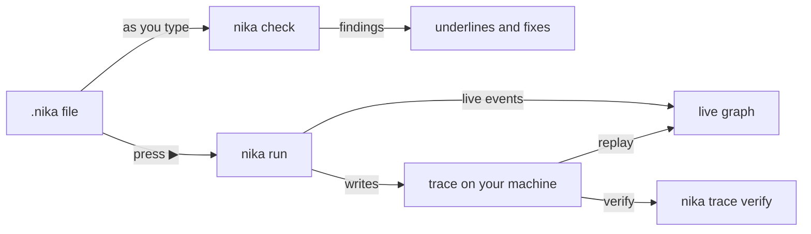

<p align="center">
  <a href="https://nika.sh">
    <picture>
      <source media="(prefers-color-scheme: dark)" srcset="https://nika.sh/brand/nika-logo-dark.png">
      
    </picture>
  </a>
</p>

<h1 align="center">Nika Workflow Language<br><sub>for VS Code · Cursor · Windsurf · VSCodium</sub></h1>

<p align="center">
  <b>See your AI workflow as a live graph, and catch its mistakes before it runs.</b><br>
  Watch each run light up step by step, replay it later, and use the models you choose, local or cloud.
</p>

<div align="center">

[](https://marketplace.visualstudio.com/items?itemName=supernovae.nika)
[](https://marketplace.visualstudio.com/items?itemName=supernovae.nika)
[](https://marketplace.visualstudio.com/items?itemName=supernovae.nika&ssr=false#review-details)
[](https://open-vsx.org/extension/supernovae/nika)
[](https://open-vsx.org/extension/supernovae/nika)

[](https://github.com/supernovae-st/nika-vscode/actions/workflows/ci.yml)
[](https://scorecard.dev/viewer/?uri=github.com/supernovae-st/nika-vscode)
[](https://archive.softwareheritage.org/browse/origin/?origin_url=https://github.com/supernovae-st/nika-vscode)
[](LICENSE)

</div>

<!-- motion: hover, completion and the live DAG of a .nika file in the editor -->
<p align="center">
  
</p>
<p align="center"><sub>The extension's real canvas, replaying a scripted run · <a href="https://github.com/supernovae-st/nika-vscode/tree/main/scripts/media">how this clip is made</a></sub></p>

## What is Nika?

Nika turns repeatable AI work into a small file you keep. Say what you
want done, like *"every Monday, pull the action items out of my meeting
notes"*, and Nika writes it as a readable `.nika` workflow. Before
anything runs, `nika check` shows what the workflow will do, which models
and tools it uses, what it is allowed to touch and what it can cost,
without calling a model. You run it when you decide, with the model you
choose, local or cloud, and every run leaves a tamper-evident record you
can verify. One Rust binary, local-first, open source (AGPL-3.0).

| 1 · Say it | 2 · Check it | 3 · Run it | 4 · Prove it |
|:---:|:---:|:---:|:---:|
| Describe the job; Nika writes a `.nika` file | `nika check` audits it before any model is called | `nika run` with the model you choose | `nika trace verify` checks the run's record |

<table>
  <tr>
    <td align="center" valign="top" width="33%">
      <a href="https://github.com/supernovae-st/nika/raw/refs/heads/main/media/videos/chat-to-workflow.mp4"></a><br>
      <b>Why a file?</b><br>
      <sub>a request you retype every week, kept as a file that runs</sub>
    </td>
    <td align="center" valign="top" width="33%">
      <a href="https://github.com/supernovae-st/nika/raw/refs/heads/main/media/videos/full-loop.mp4"></a><br>
      <b>The four steps</b><br>
      <sub>compile, check, run and verify, in a terminal</sub>
    </td>
    <td align="center" valign="top" width="33%">
      <a href="https://github.com/supernovae-st/nika/raw/refs/heads/main/media/videos/nika-hero.mp4"></a><br>
      <b>Check, then run</b><br>
      <sub>a local model writes the action items</sub>
    </td>
  </tr>
</table>

**This extension brings those four steps into your editor.** Describe a
job on an empty canvas, see what `nika check` finds while you type, press
▶ to watch the run light up the graph, and replay or verify any past run.
The engine does the judging; the extension shows exactly what it reports.

<p align="center">
  <a href="#quick-start">Quick start</a> ·
  <a href="#what-you-get">What you get</a> ·
  <a href="#see-it-in-action">See it in action</a> ·
  <a href="#how-it-works">How it works</a> ·
  <a href="#install">Install</a> ·
  <a href="#feature-reference">Features</a> ·
  <a href="#commands">Commands</a> ·
  <a href="#settings">Settings</a>
</p>

## Quick start

1. **Install the extension.** Open the Extensions view
   (<kbd>Ctrl</kbd>+<kbd>Shift</kbd>+<kbd>X</kbd>, or <kbd>⇧</kbd><kbd>⌘</kbd><kbd>X</kbd> on macOS)
   and search **Nika**. VS Code installs it from the Marketplace; Cursor,
   Windsurf and VSCodium install it from Open VSX.
2. **Add the engine.** Accept the download the extension offers (HTTPS,
   checked against the release's SHA-256, never without your consent), or
   install it yourself:

   ```sh
   brew install supernovae-st/tap/nika
   ```

3. **Watch a first run.** Open a folder and trust it. On your first
   install, a small demo workflow opens on the canvas and runs itself on
   `mock/echo`, a stand-in model built into the engine: no key, no
   network, nothing spent. A folder that already holds workflows is left
   alone, and the getting-started tour greets you instead. To run the
   demo again, use **Nika: Try the Demo Workflow** from the Command
   Palette, then press **▶ mock** on the canvas.

Then make it yours. **Nika: New Workflow File** asks for a name, a
starter and a model, and <kbd>⌘K</kbd> <kbd>⌘G</kbd>
(<kbd>Ctrl+K</kbd> <kbd>Ctrl+G</kbd>) opens its graph. When you are
ready, change `model: mock/echo` to a local model or a cloud provider.
**Nika: Open the Getting-Started Tour** walks you through the rest, and
each step checks itself off as you do it.

> [!NOTE]
> Until you trust a folder (Restricted Mode), you get syntax colors and
> snippets only: the engine, the language server, commands and the demo
> wait, and Nika writes no files. Review the folder, then use **Manage
> Workspace Trust**. A mock run needs trust too: no key and no spend does
> not mean no local effects.

## What you get

| You get | What it does for you |
|---|---|
| **A live graph** | Each step is a card that shows its prompt, command or tool, and the wires show where each piece of data goes. |
| **Errors as you type** | The engine's check underlines problems, explains each one and offers one-keystroke fixes, before any model is called. |
| **The cost up front** | Each step shows its price range and the workflow shows its ceiling, worked out from the file before any run. |
| **Runs you can watch** | Press ▶ and the graph lights up wave by wave (a wave is the steps that run together), with a live spend counter and a verdict at the end. |
| **Every run, replayable** | Each run leaves a record on your machine: replay it, step backward through it in the debugger, or compare two runs. |
| **Proof of what ran** | One command asks the engine to verify a run's tamper-evident record; the run report shows only what that record says. |
| **Your models** | Ollama, llama.cpp, vLLM and LM Studio on your machine, or any cloud provider the engine knows: change one `model:` line. |
| **Help for your AI agent** | Agents in your editor check the workflows they write through Nika's Language Model tools and MCP server. |
| **No telemetry** | The extension collects nothing. Run records and reports stay on your machine unless you export them. |

## See it in action

### Errors as you type

<p align="center">
  <a href="https://github.com/supernovae-st/nika/raw/refs/heads/main/media/videos/editor-diagnostics.mp4">
    
  </a>
</p>
<p align="center"><sub>Real diagnostics from the engine's language server (<code>nika lsp</code>); the editor around them is drawn · <a href="https://github.com/supernovae-st/nika/raw/refs/heads/main/media/videos/editor-diagnostics.mp4">watch the video</a></sub></p>

- **The engine's own verdict.** Each underline is a `nika check` finding
  with its `NIKA-…` code and an explanation one click away, so a clean
  editor means a clean check.
- **Fixes, not just flags.** A missing permission, a mistyped name or a
  pasted API key: the fix is one quick fix away
  (<kbd>Ctrl</kbd>+<kbd>.</kbd>, or <kbd>⌘</kbd><kbd>.</kbd> on macOS).
- **The whole workspace.** Files you have not opened are checked too, and
  their findings wait in the Problems panel.

> [!TIP]
> Squiggles follow every keystroke. For a calmer editor, set
> `nika.diagnostics.runOn` to `save`.

### One graph, five ways to read it

<p align="center">
  
</p>

| Press | To see |
|:---:|---|
| <kbd>X</kbd> | what happens if the selected step fails: dead paths dim, recovery paths light up |
| <kbd>T</kbd> | the recorded run as a timeline, retries and cache hits included |
| <kbd>P</kbd> | what the file can reach, run and touch before a token is spent |
| <kbd>D</kbd> | where each piece of data comes from and where it goes |
| <kbd>H</kbd> | where the time went (before a run: where the cost is) |
| <kbd>Esc</kbd> | back to the map |

### More to watch

<table>
  <tr>
    <td align="center" valign="top" width="33%">
      <a href="https://raw.githubusercontent.com/supernovae-st/nika-vscode/main/media/dag-execution.gif"></a><br>
      <b>A 38-step run</b><br>
      <sub>waves light up, images land as the run makes them</sub>
    </td>
    <td align="center" valign="top" width="33%">
      <a href="https://github.com/supernovae-st/nika/raw/refs/heads/main/media/videos/permits-audit.mp4"></a><br>
      <b>The boundary</b><br>
      <sub>what a workflow may touch, and the escape the check catches</sub>
    </td>
    <td align="center" valign="top" width="33%">
      <a href="https://github.com/supernovae-st/nika/raw/refs/heads/main/media/videos/workflow-gallery.mp4"></a><br>
      <b>Ready-made jobs</b><br>
      <sub>the gallery behind <i>Nika: Try an Example</i></sub>
    </td>
  </tr>
</table>

## How it works


```mermaid
flowchart LR
  file[".nika file"] -- "as you type" --> check["nika check"]
  check -- findings --> marks["underlines and fixes"]
  file -- "press ▶" --> run["nika run"]
  run -- "live events" --> canvas["live graph"]
  run -- writes --> trace["trace on your machine"]
  trace -- replay --> canvas
  trace -- verify --> proof["nika trace verify"]
```

The extension never judges your workflow itself. Every underline, number
and color comes from the `nika` engine you installed. That is why the
fields and tools a newer engine knows appear in your completions without
an extension update, and why the graph never shows a result the engine
did not report.

## Install

| Your editor | Install from |
|---|---|
| **VS Code** | the [Visual Studio Marketplace](https://marketplace.visualstudio.com/items?itemName=supernovae.nika), or `code --install-extension supernovae.nika` |
| **Cursor · Windsurf · VSCodium** | [Open VSX](https://open-vsx.org/extension/supernovae/nika), through the same Extensions search |
| **JetBrains · Zed · Neovim** | not this extension: they get the same checks from `nika lsp` and the published JSON Schema |

**The engine** powers everything past syntax colors. Install it with
`brew install supernovae-st/tap/nika`, or accept the download the
extension offers on first open: HTTPS only, verified against the
release's SHA-256 before it lands, and only with your consent
([policy](SECURITY.md)). Without the engine you still get syntax colors,
snippets and a graph the extension draws itself; completions from the
engine's schema (`nika spec --schema`) arrive with the engine.

> [!IMPORTANT]
> This version needs a stable engine, **0.120.1 or newer**. To use a
> binary you already have, point `nika.server.path` at it. An older,
> malformed or prerelease engine gets an update notice; the extension
> never replaces your binary behind your back.

<details>
<summary><b>How the extension chooses and checks the engine</b></summary>

- Every binary is checked before the language server, workflow runs or
  agent wiring start: configured, bundled, on PATH, cached or downloaded,
  and again on every restart. Syntax, snippets and static views stay
  available meanwhile.
- The integration suites target public engine **v0.120.1** from
  `ENGINE_PIN`, verified against the archive digests and build commit
  stored in the installer. Marketplace publication and native
  first-contact qualification are separate release gates.
- A download always asks first, and an unsupported latest public release
  is refused before its executable is fetched.
- Discovery freezes the chosen executable's absolute path, PATH entries
  and symlinks included. MCP wiring uses the same choice: Cursor and
  Windsurf can receive a machine-scoped absolute path, and portable
  VS Code wiring is refused until `nika` on PATH resolves to the admitted
  engine. This keeps the path consistent; it does not stop anyone from
  replacing the file on disk later.
- Commands that open a terminal need an open folder. They start the
  admitted engine with separate arguments, never a generated shell line,
  and keep the result in the task terminal. VS Code `${…}` variables in
  those arguments are refused before submission; run the CLI yourself
  when you need those literal values. Doctor suggestions are copied for
  you to review, never run for you.

</details>

## Feature reference

Everything the extension does, grouped. Open a section when you need it.

<details>
<summary><b>Checks and fixes in the editor</b></summary>

- **Everything `nika check` reports**, as you type: conformance, secret
  leaks and egress, permits escapes, schema findings, unknown tools,
  mistyped or missing tool arguments (with did-you-mean), `when:` gates
  that can never pass, and hints. Each `NIKA-…` code links to its
  explanation. The editor carries the full family of findings behind the
  engine's verdict, so its verdict is the binary's exit code.
- **No temporary files.** Unsaved and untitled buffers go to the engine
  over stdin (`nika check -`): a fresh check on every keystroke, nothing
  written to disk. Unsupported engines are refused.
- **Quick fixes from the engine.** Its machine-applicable fixes
  (`add "X" to permits.<path>`) apply in one keystroke, the same repair
  loop agents run in CI. Did-you-mean replacements, missing declarations
  and the engine's rename repairs (`nika check --fix`) are quick fixes
  too.
- **Inferred boundary.** One command inserts the whole `permits:` block
  that `nika check --infer-permits` computes; anything it does not list is
  denied from then on.
- **Cost in the margin.** Each task shows a `$min–max` inlay hint and the
  workflow shows its ceiling on a code lens, before the run.
- **Secrets lint.** A local pattern scan (no network) flags literal
  credentials, with a quick fix that declares the key under `secrets:`
  (`source: env`) and reads it masked as `${{ secrets.<name> }}`.
- **Your severities.** `nika.diagnostics.severity` remaps any code or
  family (`NIKA-SEC-*`), and `off` hides one. Related information walks
  you to both ends of a missing wire.

</details>

<details>
<summary><b>An action above every section of the file</b></summary>

Each key line of a workflow carries a code lens: a clickable action for
what that line is for, fed by the source that owns the answer (the spec's
proven starters, this engine's catalog, the file's own graph).

| Line | Actions | What it writes |
|---|---|---|
| `nika:` | GitHub · Check · DAG · Run · Explain | nothing: the identity line (the file's mark and its name; the envelope has nine keys) |
| `model:` | *choose your model* | a catalog reference, local models first |
| `inputs:` | *declare an input* · *make it callable · N untyped* | a typed input (`type:` is required) · the untyped-to-typed repair |
| `tasks:` (status row) | the verdict and ceiling · *add a task* · *declare the boundary* · *choose your model* (when none is set) · *choose what it publishes* (when output goes unread) · *N inputs ride --var* | one gesture for each gap that blocks a run |
| a task key, such as `greet:` | *re-run* · *see it in the graph · N refs* · *make it resilient* (only after a failed run) | `run --task` · focus on the graph · retry, recover, skip or timeout |
| `after:` | *order on state* | a pre-checked pick of `{producer: predicate}` entries; a task's descendants are never offered, so no cycle |
| `when:` | *choose a gate* | a CEL v0.1 condition over local reads (the value authorities and `with:`); upstream state becomes `after:`, and an upstream value is hoisted through `with:` first |
| `for_each:` | *choose the collection* | list-typed inputs (`{ array: T }`) or upstream outputs bound through `with:` (the binding is the edge) |
| `infer:` · `exec:` · `agent:` | *choose a starter* · *type its output* (when the schema is missing) | the spec's shapes · a proven schema (fields, list, verdict, grade) |
| `invoke:` | *choose your tool* | starters and every builtin this engine carries, with an args skeleton from the tool's own schema |
| agent `tools:` | *choose its tools* | a pick from the catalog; MCP entries, globs and unknown names stay as written, and `[]` is least privilege |
| `outputs:` | *choose what it publishes* | the rows it owns, re-picked; typed, jq and commented rows stay as written |
| `permits:` | *tighten the boundary* | the `--infer-permits` recompute, in one undo |

Every write is one edit with one undo, refuses to apply if its anchor
moved, and never guesses what the engine can judge.

</details>

<details>
<summary><b>Language intelligence</b></summary>

- **Completions and hover from the engine.** Keys, values and docs come
  from the installed binary (`nika spec --schema`, `nika spec --canon`):
  top-level keys, task fields, per-verb bodies, enums such as `capture`
  and `backoff_strategy`, the builtin tools, provider-prefixed `model:`
  values and `nika:fetch` extract modes. A field the engine adds appears
  here with no extension update.
- **Expressions.** Completion, hover and go-to-definition inside
  `${{ ... }}`, across the three value authorities (`inputs.`, `const.`,
  `secrets.`) and the two runtime namespaces (`with.`, `tasks.`).
- **Rename and references.** A task rename updates all four places an id
  lives (its declaration, `after:` entries, `${{ tasks.X }}` expressions,
  bare CEL in work-in-progress text) and enforces the engine's id rules
  (snake_case, CEL-safe). With linked editing, every reference follows as
  you type.
- **Structure.** Smart selection grows from word to line, task, tasks and
  document. The native Call Hierarchy shows task dependencies (incoming:
  what a task unlocks; outgoing: what it needs). Outline and breadcrumbs
  list tasks with their verb, plus the permits boundary.
- **Language status.** The `{}` status item shows the engine version, the
  active file's verdict (busy while a check runs) and the language server
  state.
- **Full language server.** When the engine provides `nika lsp`, it takes
  over automatically; the client tells it which layers it keeps
  (`initializationOptions`), so nothing is reported twice.
- **Syntax, snippets and semantic colors** for the four verbs. Every
  snippet is tested against `nika check`.
- **Add Task from anywhere** (<kbd>⌘K</kbd> <kbd>⌘N</kbd>): one picker with
  the four verbs and every builtin as a pre-wired `invoke:`, described
  from the engine's own catalog. The skeleton lands after the task under
  your cursor, with its new id selected.
- **Draft from a sentence.** On an empty canvas, describe the job. When
  your editor offers a language model, the extension drafts candidates
  and checks each one with the engine; without one, it copies a grounded
  prompt for your own chat and opens the closest template.

</details>

<details>
<summary><b>Before a run: preflight, lineage and the audit on the canvas</b></summary>

- **Preflight** (`Nika: Preflight`) is the flight plan before any token:
  every infer and agent model resolved against the engine catalog
  (`nika catalog`: providers and models with their capabilities and
  environment variables; builtin tools in `nika catalog --tools`) with its
  key needs (local providers marked sovereign, mock marked zero-spend);
  secrets and environment reads checked against your real environment
  (`env` sources verified; vault and file sources say *declared*, never
  *verified*); permits, capability escapes and secret flows; the
  wave-by-wave plan; and the cost ceiling with its prices named (the
  pricing source, date and model count, and a staleness hint past 120
  days). A chip on the run pill keeps the verdict in view
  (`✗ 2 missing` · `⚠ flows` · `✓ preflight`); click it for the details.
- **Follow the data.** Click a card, or put the caret inside
  `${{ tasks.x… }}` in the YAML: the producer and every consumer stay lit
  (direct neighbors brighter than the rest), the data wires saturate, and
  everything else fades. <kbd>Esc</kbd> clears.
- **The audit on the canvas.** A cost forecast on the run pill
  (`$min–$max` when `nika check` can price the file, an amber `≥ $X` when
  an uncapped task makes it a floor); `⚠N` chips on cards with that
  task's findings (secret flow, permits, schema, unknown tools), each
  opening the report; a `△N` count of what a run will re-execute; and a
  `Δ ±$` delta of what your edits changed in cost since the last commit,
  amber only when it grew. Every number is static, read before a token is
  spent.
- **Stale steps.** A `△ stale` badge marks each task edited since its last
  successful run, and everything downstream of it. That state lives in a
  `.nika/canvas-state.json` sidecar, never in your workflow file.
- **Explain, inspect, dry-run.** `Nika: Explain Workflow` tells the story
  wave by wave (cost ceiling, what it touches, structural risks) with no
  model, offline. `Nika: Inspect Anatomy` shows `nika inspect`, and
  **Dry-Run** shows the engine's `--dry-run` plan with zero effects.

</details>

<details>
<summary><b>The canvas: reading a workflow</b></summary>

- **Lenses and views.** Besides <kbd>X</kbd> <kbd>T</kbd> <kbd>P</kbd>
  <kbd>D</kbd> <kbd>H</kbd>: <kbd>W</kbd> wave bands, <kbd>B</kbd> smooth
  or square wires, <kbd>G</kbd> follow the run's frontier, <kbd>L</kbd>
  the activity feed, <kbd>?</kbd> what am I looking at.
- **Cards carry the content.** Before any run, infer cards show their
  prompt, exec cards their `$ command`, invoke cards their tool and args.
  An inputs row names the incoming wires (`alias ← producer`; click one to
  jump to it). A policy row shows the declared execution policy as chips
  (retry `×3`, timeout `30s`, the `on_error` route, named output bindings,
  permits); a settled card adds its recorded spend (`✓ 1.2s · $0.0042`).
- **Expanded cards.** The header floats above the frame (verb, task id,
  and a model chip you click to change the model), and a pill below holds
  the key parameters (`16:9 ×3`, `voice · format`, the HTTP method), the
  static cost range and the recorded mean `⌀`, then `⤓` open the
  artifact, `⑂` fork, `⋯` every action with its shortcut (<kbd>K</kbd>).
- **Two card sizes.** `min` shows the head, the verdict and one line;
  `grand` tells the full story (run facts, blast radius, pinch points,
  needs and unlocks, an actions row `▸ run · ⚡ what if · ❏ dup`, plus
  `✎ explain` and `⑂ fork` on a failed card). Double-click or
  <kbd>E</kbd> toggles one card, <kbd>Shift</kbd>+<kbd>V</kbd> sets them
  all (min, grand, mix), and <kbd>Space</kbd> peeks at the focused card.
  Right-click is a real VS Code menu (run task, open YAML, duplicate,
  delete, copy id). Nothing declared, nothing drawn.
- **Each verb has a character.** `infer` wears a thought aurora and its
  tile breathes while the model thinks; `exec` shows CRT scanlines and a
  blinking caret while the process runs; `invoke` carries a flowing
  current during the call; `agent` turns an orbit ring while its loop
  runs. At rest, cards stay still, and every animation honors reduced
  motion. Each builtin carries its identity too: six category tints, port
  collars typed by what flows through them, and a one-line description
  from the engine's catalog.
- **Media cards.** `image_generate` shows an empty frame at its declared
  aspect ratio (the `n:` count as a corner chip, the provider as caption),
  `tts_generate` a bar strip with `voice · format`, `chart` a sketch of
  its declared type, `image_fx` the recipe beside the result. A develop
  sweep rides the run, then the recorded artifact becomes the card's body
  (image thumbnails that open the file, playable audio), taken from the
  latest matching trace and refreshed when a live run closes. Only files
  a run actually wrote appear. Running tasks show their observed elapsed
  time (`12.4s ⋯`) until the engine's measured duration lands.
- **The minimap** is a second reading of the graph, in three layers:
  faint bands for the waves, every wire (an overview without edges cannot
  show order), and the critical path in amber. Its frame clamps to the
  card and fades when it covers the whole graph. Drag anywhere in it to
  fly; hovering a task lights it on the canvas too.
- **Wires like a metro map.** Rounded right angles on aligned rails, the
  same style when you drag a card; where two wires cross, the upper one
  breaks the lower so you can read over and under.
- **Skins.** `nika` (the default) follows the nika.sh design: engineered
  black, one blue accent, the four verb hues as node spines, Martian
  Mono, and a full-spectrum aurora that sweeps once on a clean close and
  flashes red on failure. `editor` follows your theme. `phosphor` is for
  OLED screens: true black, phosphor ink, and verb colors that wake only
  on live tasks. High contrast always wins.
- **The engineering read.** Exact maximum parallelism (a Dilworth
  antichain with a witness set), the speedup ceiling (work-span),
  wall-clock estimates for k workers (Graham-bounded list scheduling, in
  measured milliseconds after a run), pinch points and per-task failure
  blast radius, in the explainer (<kbd>?</kbd>) and each card's facts.
  Algorithms and citations: [docs/ALGORITHMS.md](docs/ALGORITHMS.md).

</details>

<details>
<summary><b>The canvas: building and editing</b></summary>

- **Start by describing.** A new, empty workflow opens on a describe bar:
  type the job and a checked draft lands its tasks. Or press <kbd>N</kbd>
  for the task palette: the four verbs and every builtin tool, grouped by
  category. Picking a tool adds an `invoke` task pinned to it and named
  after it; its required arguments arrive as check findings, so the
  engine teaches you. `⧇ New` opens a blank page without leaving the
  canvas.
- **Edit on the card.** The model chip opens a provider picker and makes
  one undoable YAML edit. Ports appear on hover: drag an out-port onto a
  card to add `after: { from: success }`, or drop it on empty canvas for a
  new pre-wired task.
- **The command bar** at the bottom: `+ infer after gather` inserts a
  task, `/text` filters, and a sentence goes to checked generation.
  Semantic zoom keeps 100-task graphs readable as a map.
- **Filter.** Press <kbd>/</kbd> and type to fade everything except
  matching tasks (id, verb, model, tool, provider); <kbd>Enter</kbd>
  cycles through the matches.
- **Keyboard only, if you like.** <kbd>Tab</kbd> and <kbd>⇧Tab</kbd> walk
  the topological order, <kbd>↑</kbd> goes to a dependency, <kbd>↓</kbd>
  to a dependent, <kbd>Enter</kbd> opens the YAML, <kbd>C</kbd> wires the
  focused card to a target you pick, <kbd>⌥</kbd>+arrows nudge a card by
  one 8 px grid cell, <kbd>F</kbd> fits the view and <kbd>A</kbd> resets
  the layout.
- **Regions.** A `# nika:region <name>` comment groups the tasks after it
  into a labeled box (see [The language](#the-language)).
- **Export** the graph as Mermaid or Graphviz (`Nika: Export DAG`), or as
  an SVG or PNG image with styles and fonts embedded.

</details>

<details>
<summary><b>Running a workflow</b></summary>

- **Run, mock, stop.** The run pill offers **▶ Run**, **▶ mock**
  (`run --model mock/echo`: deterministic, no key, no network) and
  **■ Stop**, and follows the real process start and exit. The graph
  lights up live through the run states (running, retrying, success,
  failed, cancelled, skipped), the activity feed narrates each change,
  and the verdict and cost land at the close: the same NDJSON events the
  flight recorder writes.
- **Δ changed** re-runs only what changed (the engine's `--resume`):
  unchanged tasks reuse their recorded output (dashed `○ cached` cards,
  never painted as fresh), and edited tasks run again.
- **Recovered is not clean.** A task saved by `on_error: recover` says
  `✚ recovered` in amber on its card, in the activity feed, the legend
  and the run report, with the absorbed `NIKA-…` code in the card's
  facts.
- **Live spend.** The status pill adds up recorded spend as tasks settle
  (`2 done · 4 running · ≥ $0.0022`): engine facts only, `≥` because
  unpriced tasks make it a floor, and nothing at all for a mock or
  local-only run rather than a fake `$0.00`. Each card pairs its estimate
  (`cost $min → $max`) with what it spent (`spent $… recorded`).
- **The source follows the run.** While a run executes or a replay
  scrubs, the YAML of the running tasks glows.
- **Ghost values.** Each `${{ tasks.x… }}` shows, inline, what it resolved
  to in the last matching recorded run (` = "Hello HN"`, the full value on
  hover). No recorded value, no hint.
- **Paused runs ask you.** A `nika:prompt` task pauses the run (a pause is
  not a failure: the verdict turns amber ⏸ with the question itself). A
  notification offers **Answer…** with the right control (Yes/No, the
  workflow's own choices, or a text box), and your answer resumes the
  exact journal the engine wrote: upstream tasks reuse their results, and
  the gated side effects run live. Dismissed it? A `⏸ <task> asks` status
  item waits until you answer.
- **Inputs and a spend ceiling.** `Nika: Run Workflow with Inputs` turns
  the check's required inputs into a short form (<kbd>Esc</kbd> cancels
  the whole run), then offers an optional ceiling passed as
  `--max-cost-usd`.
- **The same loop in a terminal.** `nika run --var key=value` sets inputs.
  `nika test <file> --update` pins the output contract and `nika test`
  stays the offline CI gate (the mock produces schema-conformant output).
  A run you stopped, or a `nika:prompt` pause (exit 4, journaled as
  `workflow_paused`), resumes with `nika run --resume <trace>`
  (`--answer approve=true` answers the gate; cache hits stay visible),
  and every recorded run doubles as that checkpoint.
  `nika trace show <run>` re-renders a run in the terminal, `nika try`
  and `nika compile <template> <file>` scaffold from the same tested
  corpus as the snippets, and `nika explain NIKA-XXXX` explains any code.

</details>

<details>
<summary><b>After a run: replay, compare, prove</b></summary>

- **Run detail.** <kbd>Enter</kbd> on a recorded run opens one calm page:
  verdict, per-task breakdown, artifacts, spend, and the question when a
  run waits on you. It stays live while the engine writes.
- **Time-travel replay** (<kbd>⌘K</kbd> <kbd>⌘Y</kbd>). Scrub the whole
  timeline: play or pause with <kbd>Space</kbd>, drag the handle, and the
  graph shows the state at any instant, computed locally. Replay redraws;
  it never re-executes.
- **A debugger that steps backward.** Set breakpoints in your `.nika` and
  press <kbd>F5</kbd>: the engine's own debug adapter replays a recorded
  run under the VS Code debugger. Step forward and backward through task
  settles, read every recorded output in the Variables pane, and continue
  to the next breakpointed task. Stepping back is free because replay
  never re-executes. Every run in the Runs view also offers **Debug This
  Run**.
- **Compare runs.** `Nika: Run History` shows the last runs of a workflow
  as a grid (rows are tasks, columns are runs), so flaky steps are a
  recorded fact, not a guess. The run diff (<kbd>⌘K</kbd> <kbd>⌘A</kbd>)
  leads with the first divergence, centered on the canvas, then output
  changes and duration shifts.
- **Fork from a task** (<kbd>⌘K</kbd> <kbd>⌘B</kbd>, or ⑂ in the Runs
  view): that task and everything downstream run again, while everything
  upstream is restored from the trace, so you iterate without paying for
  the upstream work twice.
- **Run report.** One markdown page per recorded run: verdict, per-task
  table, artifacts with provenance (images inline), failures with their
  retry ladder (each attempt's code and clock). Every line comes from the
  trace's own events; gaps are stated, never filled.
- **Verify Journal** (<kbd>⌘K</kbd> <kbd>⌘V</kbd>) asks
  `nika trace verify <trace> --json` and opens the complete result: chain,
  seal, anchor, replay and refusal details. The other views and reports
  stay unverified observations: they never compute a second integrity
  verdict or infer a signature from hash consistency.
- **Reproduce Run.** Pick another journal of the same workflow; each task
  is classified reproduced, nondeterministic (same definition and inputs,
  different output), authored or environment, with the engine
  attestation compared.
- **Export.** One action turns a run's journal into OpenTelemetry
  (OTLP/JSON lines) for Jaeger, Aspire, Grafana or Langfuse, cost
  included: a local file, no collector, no vendor.
  `Nika: Export Evidence Pack` writes the journal, manifest, receipt and
  a VERIFY.md.
- **Flight recorder.** The Runs view lists `.nika/traces/*.ndjson`
  (status, duration and cost per run) and replays any of them on the
  graph.
- **Tests.** Workflows with a `<file>.golden.json` run in the native Test
  Explorer, where the failure message is the engine's per-path diff; a
  second profile re-pins the golden. `Nika: Golden Test` runs
  `nika test <file>` (mock model, offline, deterministic) and
  `Nika: Update the Golden` re-pins it.

</details>

<details>
<summary><b>Agents, MCP and the Station</b></summary>

- **Language Model tools.** `nika_check`, `nika_explain`, `nika_graph` and
  `nika_workspace` let the agents in your editor check the workflows they
  write through the real engine instead of guessing (`nika_workspace`
  appears only when the engine supports it).
- **MCP and rules in one command.** `Nika: Setup MCP + Agent Rules` wires
  your editor's MCP configuration and Cursor rules (through `nika wire`),
  with a one-tap follow-up for Codex and Claude. On VS Code 1.101 or
  newer, agent mode finds `nika mcp` natively, with no config file.
  `nika init` sets up a repository: VS Code schema wiring, `AGENTS.md`, a
  Cursor rule and MCP, and the authoring skill.
- **Terminal agents too.** `nika wire cursor`, `nika wire claude`,
  `nika wire windsurf` or `nika wire codex` patch each client's MCP
  configuration, idempotently, keeping your other servers.
- **Agent plugins.** [nika-plugins](https://github.com/supernovae-st/nika-plugins)
  is the agent side of Nika. Claude Code:
  `claude plugin marketplace add supernovae-st/nika-plugins`, then
  `claude plugin install nika@nika`. Codex:
  `codex plugin marketplace add supernovae-st/nika-plugins`, then
  `codex plugin add nika@nika`. For Cursor and other hosts, its README
  has the steps and explains who does what (the plugin per agent,
  `nika init` per repository, `nika wire` per machine).
- **A prompt for any chat.** `Nika: Copy AI Authoring Prompt` copies the
  template, check and repair protocol for any chat assistant.
- **Doctor.** `Nika: Doctor` runs the engine's own environment diagnosis
  (binary, configuration, provider keys, image and speech planes) and
  prints exact fixes without changing anything.
  `Nika: Doctor + Ping Local Providers` also probes your local provider
  ports only (Ollama, LM Studio, llama.cpp, LocalAI, vLLM) over loopback,
  with a 300 ms cap and nothing sent on the socket.
- **The Station** is one tree for the machinery: the engine (its version;
  a grammar that is too old names itself), the doctor's verdict with each
  fix one click away, your agent clients and their wiring
  (`Agents · 3/6 wired`), and your providers (local runtimes detected,
  cloud keys counted, `3/11 present`).
- **Local models, start to finish.** One row per downloaded GGUF model
  (`owner/repo:QUANT`, its size, the engine's remark), read live from
  `nika model list`. **Serve a model…** opens the OpenAI-compatible
  server in a terminal, in the foreground on purpose: its banner says how
  workflows reach it, and <kbd>Ctrl</kbd>+<kbd>C</kbd> stops it.
  **Pull a model…** keeps the engine's safeguards (the size prints before
  a byte downloads, 2 GiB and more asks for confirmation, an interrupted
  pull resumes). Removing a model sits behind the wrench and a
  confirmation.

</details>

<details>
<summary><b>Honest by construction</b></summary>

- **The engine decides what the UI offers.** After version admission, the
  extension probes what the binary actually ships. Language server,
  workflow and wiring features need their current capabilities, and a
  refused operation never falls back to a retired command spelling.
- **The binary is the vocabulary.** The spec, JSON Schema, examples and
  templates are read from the self-contained binary (`nika spec`,
  `nika spec --schema`, `nika try`, `nika compile --list`): nothing
  duplicated, nothing drifting.
- **Run journals belong to the engine.** The extension neither duplicates
  nor prunes them. Resume uses the journal announced for the current
  workflow, or asks you to pick one; canceling the picker starts no run.
- **A 16 MiB reading limit.** The editor reads at most 16 MiB per
  journal, live or recorded. A larger file stays on disk, and the detail,
  report and replay views say why no partial preview loads. This is not a
  global cache budget, nor a claim that the file cannot change while it
  is read; engine CLI operations keep their own limits and integrity
  checks.
- **Optional download, zero telemetry.** `nika.server.autoDownload` turns
  the download offer off, and a download is always SHA-256 verified.

</details>

## Commands

The sixteen you will reach for first. The full list is in the extension's
**Feature Contributions** tab in your editor.

| Command | What it does |
|---|---|
| `Nika: Try the Demo Workflow` | writes the four-wave hello-canvas demo beside the canvas; offline, nothing spent |
| `Nika: New Workflow File` | a short wizard: name, starter, model (mock first, then local models) |
| `Nika: Open the Canvas (workflow DAG)` | the live graph (a welcome page when no workflow is open) |
| `Nika: Run Current Workflow` | `nika run --json` streamed onto the graph, verdict at the end |
| `Nika: Run Workflow with Inputs` | required inputs become a short form; an optional spend ceiling rides `--max-cost-usd` |
| `Nika: Resume Last Run` | re-runs what changed; unchanged tasks reuse their recorded output |
| `Nika: Validate Current Workflow` | the engine's full `nika check` verdict, on demand |
| `Nika: Preflight` | cost, secrets, permits and the wave plan, before any token |
| `Nika: Explain Workflow` | the workflow's story, wave by wave; no model, offline |
| `Nika: Golden Test` | `nika test` against the pinned golden output (mock model, offline) |
| `Nika: Replay a Recorded Run` | scrub a past run's timeline; replay redraws, never re-executes |
| `Nika: Diff Two Runs on the DAG` | the first difference leads, its task centered on the graph |
| `Nika: Run Report` | a run's recorded events and stated gaps; verification stays a separate command |
| `Nika: Run History` | the cross-run grid: flaky steps become a recorded fact |
| `Nika: Doctor` | the engine checks its environment and prints exact fixes; it changes nothing |
| `Nika: Open the Getting-Started Tour` | the walkthrough; each step checks itself off as you go |

## Keyboard shortcuts

Each chord works in a `.nika` file (*file*), on the canvas (*canvas*) or
in the Nika side bar (*side bar*). Every shortcut can be changed: open
Keyboard Shortcuts (<kbd>⌘K</kbd> <kbd>⌘S</kbd>, or <kbd>Ctrl+K</kbd>
<kbd>Ctrl+S</kbd>) and search "nika".

| macOS | Windows, Linux | Does | In |
|---|---|---|---|
| <kbd>⌘K</kbd> <kbd>⌘M</kbd> | <kbd>Ctrl+K</kbd> <kbd>Ctrl+M</kbd> | search everything: commands, tasks, workflows, recorded runs | file, canvas |
| <kbd>⌘K</kbd> <kbd>⌘G</kbd> | <kbd>Ctrl+K</kbd> <kbd>Ctrl+G</kbd> | open the canvas | file |
| <kbd>⌘K</kbd> <kbd>⌘E</kbd> | <kbd>Ctrl+K</kbd> <kbd>Ctrl+E</kbd> | run the workflow | file |
| <kbd>⌘K</kbd> <kbd>⌘K</kbd> | <kbd>Ctrl+K</kbd> <kbd>Ctrl+K</kbd> | validate with the engine's full check | file |
| <kbd>⌘K</kbd> <kbd>⌘N</kbd> | <kbd>Ctrl+K</kbd> <kbd>Ctrl+N</kbd> | add a task | file |
| <kbd>⌘K</kbd> <kbd>⌘Y</kbd> | <kbd>Ctrl+K</kbd> <kbd>Ctrl+Y</kbd> | replay a recorded run | file, canvas |
| <kbd>⌘K</kbd> <kbd>⌘A</kbd> | <kbd>Ctrl+K</kbd> <kbd>Ctrl+A</kbd> | compare two runs | file, canvas |
| <kbd>⌘K</kbd> <kbd>⌘B</kbd> | <kbd>Ctrl+K</kbd> <kbd>Ctrl+B</kbd> | fork from a task | file, canvas |
| <kbd>⌘K</kbd> <kbd>⌘V</kbd> | <kbd>Ctrl+K</kbd> <kbd>Ctrl+V</kbd> | verify a run's journal | file, canvas |
| <kbd>⌘K</kbd> <kbd>⌘H</kbd> | <kbd>Ctrl+K</kbd> <kbd>Ctrl+H</kbd> | try the demo | file, canvas |
| <kbd>⌘K</kbd> <kbd>⌘.</kbd> | <kbd>Ctrl+K</kbd> <kbd>Ctrl+.</kbd> | every action of the focused row | side bar |

On the canvas itself: <kbd>N</kbd> add a task · <kbd>/</kbd> filter ·
<kbd>X</kbd> <kbd>T</kbd> <kbd>P</kbd> <kbd>D</kbd> <kbd>H</kbd> lenses ·
<kbd>W</kbd> wave bands · <kbd>G</kbd> follow the run · <kbd>L</kbd>
activity feed · <kbd>F</kbd> fit · <kbd>A</kbd> auto-layout ·
<kbd>E</kbd> expand a card · <kbd>K</kbd> card actions · <kbd>?</kbd>
help.

## Settings

The ones you are most likely to change. Every setting, with its default,
is in the extension's **Feature Contributions** tab.

| Setting | Default | What it controls |
|---|---|---|
| `nika.server.path` | `nika` | which engine binary to use; point it at a dev build and every feature follows |
| `nika.server.autoDownload` | `true` | offer a verified engine download (HTTPS, SHA-256, your consent) |
| `nika.dag.theme` | `nika` | the canvas look: `nika`, `editor` (your theme), `phosphor` (OLED) or `auto` |
| `nika.diagnostics.runOn` | `type` | when checks run: `type`, `save` or `off` |
| `nika.diagnostics.severity` | `{}` | a finding's severity per code or family (`NIKA-SEC-*`); `off` hides it |
| `nika.run.liveDag` | `true` | stream runs onto the graph instead of a terminal |
| `nika.replay.speed` | `6` | replay speed: 6 plays six times faster than recorded |
| `nika.editor.xray` | `true` | ghost values: what each `${{ tasks.x… }}` resolved to, inline |
| `nika.ai.toolsEnabled` | `true` | register the four Language Model tools for agents in your editor |

## Deep links

A runbook, a pull request or a chat message can open the editor on a
workflow with a `vscode://` link:

```text
vscode://supernovae.nika/dag?file=deploy.nika      open the canvas on a workflow
vscode://supernovae.nika/check?file=deploy.nika    audit it (asks first)
vscode://supernovae.nika/run?file=deploy.nika      run it (asks first)
vscode://supernovae.nika/search?q=deploy           open search with a query
vscode://supernovae.nika/demo                      open the offline demo
```

> [!NOTE]
> Links are guarded. `file` must be a workflow path relative to the open
> workspace; absolute paths, `..` and anything that resolves outside it
> are ignored. A link never runs anything by itself: `run` and `check`
> always ask with a native confirmation before the engine touches the
> file. An unknown link shows a brief status bar message and does nothing.

## The language

A workflow has four verbs, and that set is locked: `infer` asks a model,
`exec` runs a command, `invoke` calls a builtin or MCP tool (fetching a
URL is the `nika:fetch` builtin), and `agent` runs an agent loop whose
tools are denied unless you list them.

```yaml
nika: hello               # the identity line: nika: <kebab-id>

model: mock/echo          # deterministic · swap for ollama/qwen3.5:4b or any provider

tasks:
  greet:
    infer:
      prompt: "Say hello in French, in one short sentence."
```

The whole language is in the
[specification](https://github.com/supernovae-st/nika-spec) (Apache-2.0)
and the [documentation](https://docs.nika.sh).

<details>
<summary><b>Canvas regions</b> (editor only; the engine ignores them)</summary>

A `# nika:region <name>` comment groups the tasks that follow it into a
labeled box on the canvas. It is a plain YAML comment, so the engine never
sees it and it costs nothing at run time:

```yaml
tasks:
  # nika:region Ingest
  fetch_pr:
    invoke: { tool: "nika:fetch", args: { url: "${{ inputs.pr_url }}" } }
  analyze_diff:
    with: { diff: "${{ tasks.fetch_pr.output }}" }
    infer: { prompt: "Plan the review of ${{ with.diff }}." }

  # nika:region Ship
  post_comment:
    after: { analyze_diff: success }
    exec: { command: ["gh", "pr", "comment", "${{ inputs.pr }}", "--body-file", "verdict.md"] }
```

</details>

## Icons in your editor

The extension puts the butterfly on its Marketplace tile, in the activity
bar, and on `.nika` files as a 16 px language icon, in themes that show
language icons (the default Seti theme does). Other file and folder icons
come from your file icon theme:

- **Material Icon Theme**: give the engine's `.nika/` folder an icon
  today:

  ```jsonc
  "material-icon-theme.folders.associations": { ".nika": "flow" }
  ```

- **vscode-icons**: a full butterfly set (file, folder, open folder) is
  in [`contrib/`](contrib/README.md).
- **Upstream**: Material icons for `nika` files and the `.nika` folder are
  proposed in
  [material-icon-theme#3530](https://github.com/material-extensions/vscode-material-icon-theme/pull/3530)
  (sources in [`contrib/material-icon-theme/`](contrib/README.md)).

<!-- city:map -->
## 🦋 The Nika family

| | Repository | What it gives you |
|---|---|---|
| 🦋 | [nika](https://github.com/supernovae-st/nika) | The engine and CLI: write, check, run and verify AI workflows |
| 📖 | [nika-docs](https://github.com/supernovae-st/nika-docs) | The documentation, live at [docs.nika.sh](https://docs.nika.sh) |
| 📜 | [nika-spec](https://github.com/supernovae-st/nika-spec) | The language specification and the suite that proves an engine follows it |
| 🧩 | **[nika-vscode](https://github.com/supernovae-st/nika-vscode)** | **The editor extension: your workflow as a live graph, errors as you type** |
| 🟦 | [nika-client](https://github.com/supernovae-st/nika-client) | Run and verify workflows from TypeScript |
| ✅ | [nika-action](https://github.com/supernovae-st/nika-action) | A GitHub Action that posts a `nika check` verdict on your pull requests |
| 🚀 | [nika-actions-starter](https://github.com/supernovae-st/nika-actions-starter) | A ready template: workflows, editor setup and CI from the first push |
| 📦 | [nika-registry](https://github.com/supernovae-st/nika-registry) | Shareable workflows, pinned and re-verified |
| 🤖 | [nika-plugins](https://github.com/supernovae-st/nika-plugins) | Teaches your coding agent (Claude Code, Codex, Cursor…) to write Nika |
| 🍺 | [homebrew-tap](https://github.com/supernovae-st/homebrew-tap) | `brew install supernovae-st/tap/nika` |
| 🐙 | [gh-nika](https://github.com/supernovae-st/gh-nika) | The Nika CLI as a GitHub CLI extension |
| 🏛️ | [nika-estate](https://github.com/supernovae-st/nika-estate) | Where each file in Nika's core repositories comes from, declared and re-checkable |
<!-- /city:map -->

## Privacy and security

- **No telemetry.** The extension collects nothing; nothing phones home.
- **Your runs stay local.** Traces live in `.nika/traces/` in your
  project. An export (OpenTelemetry lines, an evidence pack) is a file on
  your disk; where it goes next is up to you.
- **One program, started safely.** The extension runs one program, the
  `nika` engine, with separate arguments and timeouts, never a shell line
  built from your text.
- **A locked canvas.** The canvas panel runs only the extension's own
  bundled scripts under a `default-src 'none'` Content-Security-Policy,
  and loads nothing from the network.
- **A checked download.** The optional engine installer fetches only from
  `github.com/supernovae-st/nika` releases over HTTPS, refuses any
  non-HTTPS redirect and verifies the release `SHA256SUMS` before
  anything lands. A checksum miss stops the install.
- **Secrets stay yours.** The credential lint is a local pattern scan; its
  fix moves a pasted secret to `secrets:`, which masks the value in logs,
  traces and journal events. The extension stores no secrets of its own.

Found a vulnerability? Report it privately through
[GitHub security advisories](https://github.com/supernovae-st/nika-vscode/security/advisories/new),
not in a public issue. [SECURITY.md](SECURITY.md) has the details; `main`
and the latest Marketplace release are the supported versions.

## Contributing

Issues and pull requests are welcome on
[GitHub](https://github.com/supernovae-st/nika-vscode/issues).

- **Build and test:** `npm ci`, then `npm run compile` and `npm test`,
  which runs the unit tests, the repository's parity, voice and glyph
  gates, and lint. Press <kbd>F5</kbd> in VS Code to open a development
  window with your build of the extension.
- **A wrong diagnostic is usually an engine issue.** Reproduce it with
  `nika check <file>` first; if the engine reports the same thing, open
  the issue on [supernovae-st/nika](https://github.com/supernovae-st/nika/issues).
- **Pins:** the verb starters, authoring shapes and design tokens are
  generated from the nika-spec commit in `SPEC_PIN`, and the integration
  suites run against the engine release in `ENGINE_PIN`. Nothing
  authoritative about the language is typed by hand here.
- **Media:** the canvas clips come from the real webview bundle; the
  recipes are in [`scripts/media/`](scripts/media/README.md).
- **House rules** for contributors and coding agents are in
  [AGENTS.md](AGENTS.md); the release runbook is
  [PUBLISHING.md](PUBLISHING.md).

## License

The extension is licensed under [AGPL-3.0-or-later](LICENSE). The Nika
engine is AGPL-3.0-or-later as well, and the language specification is
Apache-2.0.

## Links

- **Every way to use Nika, on one page** (install paths, editors, agents,
  skills, MCP, CI, SDKs): [docs.nika.sh/integrations/everywhere](https://docs.nika.sh/integrations/everywhere)
- **Documentation**: [docs.nika.sh](https://docs.nika.sh)
- **Engine** (AGPL-3.0-or-later): [github.com/supernovae-st/nika](https://github.com/supernovae-st/nika)
- **Language specification** (Apache-2.0): [github.com/supernovae-st/nika-spec](https://github.com/supernovae-st/nika-spec)
- **Timeline**, the verifiable record of eras, releases and claims re-proven in CI: [nika.sh/timeline](https://nika.sh/timeline)
- **Ecosystem map**, how every Nika repository connects: [nika.sh/map](https://nika.sh/map)

---

<p align="center">🦋 SuperNovae Studio · Paris</p>
