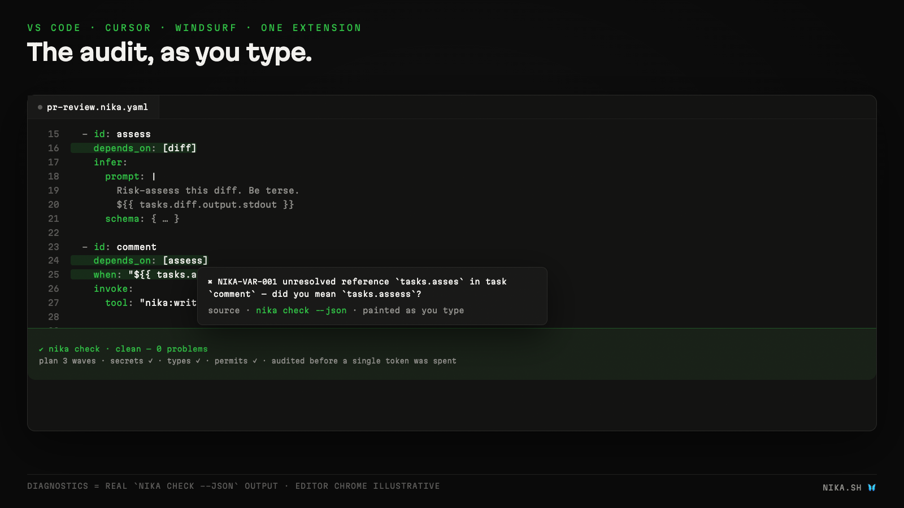

# Validate as you type

Nika is the language you can **audit before it runs** · and the editor
paints that audit live:

- **Diagnostics** from the real conformance oracle (`nika check`) with
  `NIKA-XXXX` codes · hover, or use the *Explain* quick fix
- **Quick fixes** · permits escapes repair themselves (`add "X" to
  permits.<path>`) · literal secrets rewrite to `${{ env.VAR }}`
- **Completions · hover · go-to-definition** inside `${{ ... }}` islands
  (`tasks.` · `with.` · `env.` · `secrets.` · `vars.`)
- **Static audit in the margin** · per-task cost `$min–max`, when-gates ⌁,
  fan-out ×N · the workflow cost ceiling on a code lens

The full language server (`nika lsp`) takes over automatically the day
your binary ships it · same extension, deeper rename/symbols support.
