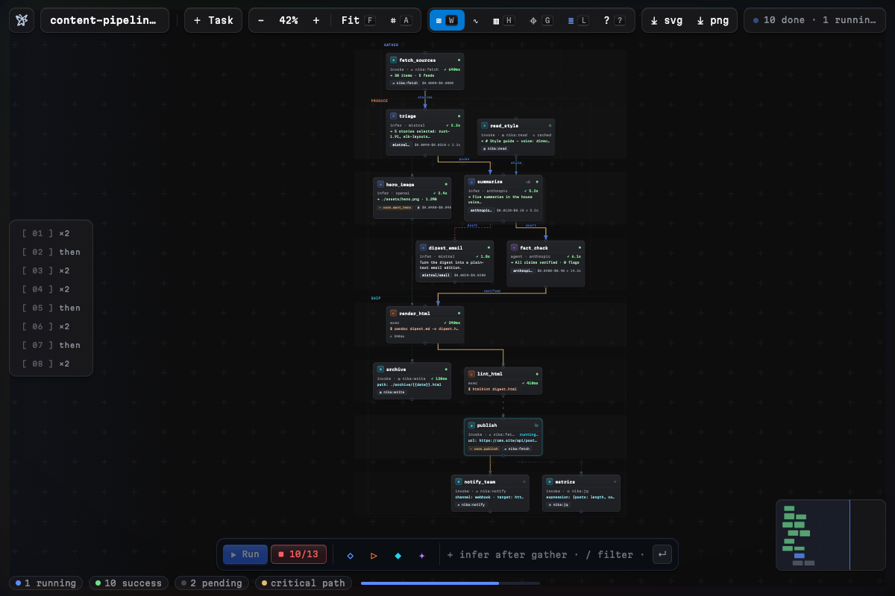

# Run it · no API key needed



The starter workflow uses `model: mock/echo`, a deterministic test provider:
install → run in 60 seconds, zero keys.

> The extension adapts to your engine build: current release binaries expose
> `nika run`, and older partial binaries fall back to `check` / demo replay
> instead of showing a broken run button.

When you're ready for real inference, swap one line:

```yaml
model: ollama/llama3.2   # no key at all
```

Local-first: `ollama/`, `lmstudio/`, `llamacpp/`, `localai/`, `vllm/` need
no cloud at all. Cloud when you choose it — `mistral/` · `huggingface/` ·
`openai/` · `xai/` · `anthropic/` and more, keys via `${{ env.… }}` ·
every key stays yours.
