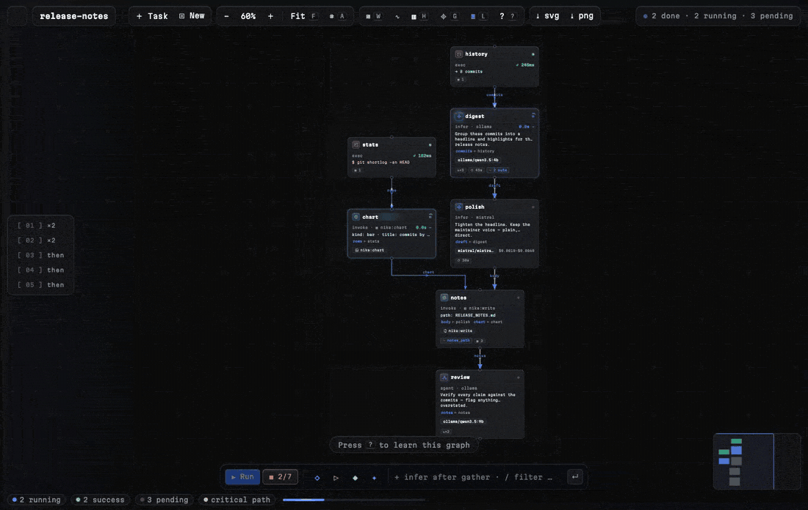

# See the DAG

`tasks` form a dependency graph (`depends_on`, `${{ tasks.x }}` references).
The DAG panel renders it live:

- click a node → jump to its YAML
- re-renders on save
- same renderer as `nika graph <file> --format mermaid` in your terminal
